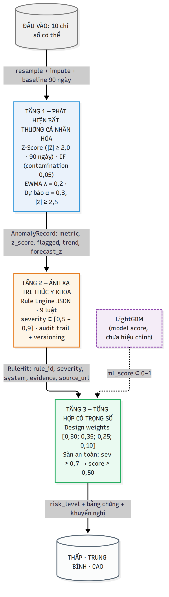
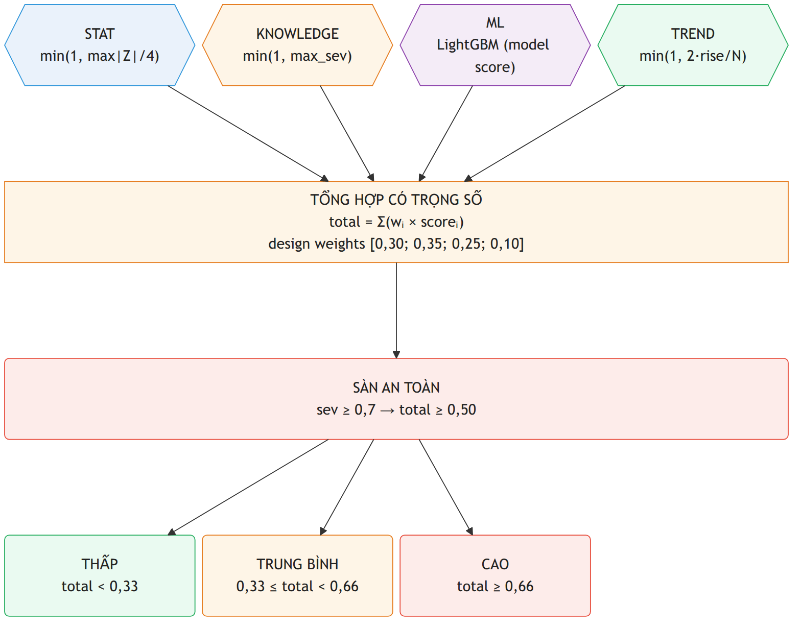

**KHUNG ĐA TẦNG HỖ TRỢ ĐÁNH GIÁ NGUY CƠ SỨC KHỎE** 

**TÍCH HỢP PHÂN TÍCH THEO ĐƯỜNG CƠ SỞ CÁ NHÂN, HỌC MÁY VÀ LUẬT THAM CHIẾU HƯỚNG DẪN Y KHOA**

**A MULTI-TIER FRAMEWORK FOR HEALTH RISK ASSESSMENT INTEGRATING PERSONALIZED BASELINE ANALYSIS, MACHINE LEARNING, AND GUIDELINE-REFERENCED MEDICAL RULES**

Nhữ Văn Kiên¹, Nguyễn Đức Cảnh2\*, Nguyễn Khắc Nam Khánh3, Vũ Đình An4

¹,²,³,4 Trường Công nghệ thông tin và Truyền thông \- Đại học Công nghiệp Hà Nội.

\* Tác giả liên hệ: Nguyễn Đức Cảnh (*0206canh@gmail.com*).

# **TÓM TẮT**

Nghiên cứu xây dựng khung đa tầng đánh giá nguy cơ sức khỏe, tích hợp phát hiện bất thường theo đường cơ sở cá nhân (Z-score, Isolation Forest, EWMA), máy thực thi luật JSON gồm chín luật tham chiếu nguồn và mô hình học máy. Điểm nguy cơ tổng hợp được tính dựa trên trọng số kinh nghiệm, độc lập với cơ chế suy luận Bayes. NHANES gộp chỉ dùng cho đối sánh cắt ngang. Với NHANES-LMF, chín biến nền tại khám MEC dự báo tử vong trong 12 tháng, huấn luyện trên 2015 \- 2016 (n \= 5.048) và đánh giá trên 2017 \- 2018 (n \= 4.773). Hồi quy logistic đạt ROC-AUC 0.8209; LightGBM đạt 0.7709. MIMIC-IV v3.1 gồm 546.028 lượt nhập viện dùng kiểm thử độ ổn định cho nhãn tử vong 30 ngày; mốc bắt đầu dự báo chưa được tái lập độc lập. ROC-AUC tương ứng là 0,7516 và 0,7508, với tỷ lệ thu nhận biến cố trong nhóm 20% nguy cơ cao nhất 52,8% và 54,3%. Do đặc thù ẩn danh dịch chuyển thời gian của MIMIC-IV, kết quả trên tập này đóng vai trò kiểm thử độ ổn định (stress test) kỹ thuật, thay vì được xem là ngoại kiểm lâm sàng. Khung hỗ trợ truy xuất thành phần điểm và luật kích hoạt, nhưng chưa chứng minh hiệu quả lâm sàng và các luật chưa được chuyên gia lâm sàng thẩm định.

**Từ khóa:** Đánh giá nguy cơ sức khỏe; học máy; hồi quy logistic; LightGBM; luật y khoa.

# **1\. GIỚI THIỆU**

Hồ sơ sức khỏe điện tử (electronic health record \- EHR) và dữ liệu sức khỏe có cấu trúc tạo điều kiện khai thác lịch sử khám, chẩn đoán, xét nghiệm và điều trị bằng học máy (machine learning \- ML) và học sâu (deep learning \- DL). Swinckels và cộng sự cho thấy EHR dọc có tiềm năng hỗ trợ phát hiện sớm, nhưng bằng chứng về kiểm định ngoài và lợi ích lâm sàng còn hạn chế \[1\]. Phân loại tốt tại một thời điểm không đồng nghĩa với dự báo biến cố tương lai. Vì vậy, bài toán đánh giá nguy cơ cần xác định rõ kết cục đích, quần thể áp dụng, <mark>mốc dự báo, khoảng dự báo và bối cảnh đánh giá</mark>. Nghiên cứu này tách biệt phân loại kiểu hình cắt ngang, phát hiện bất thường so với đường cơ sở cá nhân và dự báo biến cố có khoảng thời gian xác định

Các mô hình ML/DL và mô hình nền tảng cho EHR cho thấy tiềm năng, đồng thời đặt ra yêu cầu đánh giá vượt ra ngoài một chỉ số phân biệt. Guo và cộng sự đánh giá một mô hình nền tảng EHR được tiền huấn luyện trên 2,57 triệu hồ sơ, sau đó thích nghi tại nhiều cơ sở và báo cáo cả AUROC lẫn sai số hiệu chỉnh kỳ vọng \[2\]. Một nghiên cứu khác của Guo và cộng sự cho thấy dịch chuyển phân phối theo thời gian có thể làm suy giảm hiệu năng, trong khi mô hình nền tảng giảm mức suy giảm ở một số nhiệm vụ; đánh giá bao gồm AUROC, AUPRC và sai số hiệu chỉnh \[3\]. Foresight mô hình hóa dòng thời gian của 811.336 bệnh nhân, nhưng các tác giả cho rằng sử dụng trực tiếp đầu ra cho hỗ trợ quyết định lâm sàng hiện còn quá sớm \[4\]. Tổng quan 84 mô hình nền tảng lâm sàng của Wornow và cộng sự cũng chỉ ra khoảng cách giữa chế độ đánh giá hiện hành và giá trị đối với hệ thống y tế \[5\]. Do đó, độ bền trước dịch chuyển dữ liệu, kiểm định đa cơ sở, hiệu chỉnh và giá trị sử dụng lâm sàng cần được xem xét riêng, thay vì suy ra từ AUROC đơn thuần.

Các hướng nghiên cứu hiện có đã phát triển nhiều cấu phần liên quan; chẳng hạn, đồ thị tri thức y sinh có thể kết nối dữ liệu thực tế với tri thức bên ngoài và hỗ trợ dự báo \[6\]. Khoảng trống mà nghiên cứu hướng tới là sự thiếu vắng một khung tích hợp đồng bộ. Nghiên cứu tập trung phát triển kiến trúc kết hợp linh hoạt ba yếu tố: cá nhân hóa, hệ tri thức và học máy, thay vì chỉ tối ưu đơn lẻ từng phương pháp. Nghiên cứu tổ chức tín hiệu bất thường theo đường cơ sở cá nhân, các luật nguyên mẫu tham chiếu hướng dẫn và đầu ra ML như những nguồn bằng chứng riêng trước khi hợp nhất bằng trọng số. Cơ chế này không được xem là suy luận Bayes; khả năng truy xuất nguồn và luật kích hoạt chỉ phản ánh tính minh bạch ở mức hệ thống, không phải bằng chứng về tính đúng lâm sàng.

Nghiên cứu đặt ra hai câu hỏi. Một là, đối với tử vong mọi nguyên nhân trong 12 tháng trên NHANES Linked Mortality Files (NHANES-LMF), hồi quy logistic và Light Gradient Boosting Machine (LightGBM) duy trì hiệu năng như thế nào khi huấn luyện trên chu kỳ 2015-2016 và đánh giá trên chu kỳ 2017-2018 \[7, 8\]? Hai là, đối với nhãn tử vong 30 ngày trên MIMIC-IV v3.1, hiệu năng của hai mô hình và mức suy giảm so với đối chứng chia ngẫu nhiên thay đổi như thế nào dưới phân hoạch theo năm đã dịch chuyển (shifted year) \[9\]? Nhánh MIMIC-IV chỉ được xem là kiểm thử độ ổn định (stress test) trên bối cảnh bệnh viện khác; shifted year không phải thời gian lịch, và mốc dự báo cùng tính độc lập bệnh nhân giữa các tập chưa được tái lập độc lập nên kết quả không được diễn giải như kiểm định ngoài lâm sàng.

Bài báo có ba đóng góp chính. Thứ nhất, thiết kế kiến trúc đa tầng tích hợp phân tích bất thường theo đường cơ sở cá nhân, luật nguyên mẫu tham chiếu hướng dẫn y khoa và mô hình ML, trong đó các nguồn bằng chứng được giữ tách biệt trước bước tổng hợp. Thứ hai, thiết kế đầu ra cho phép truy xuất thành phần điểm, chỉ số bất thường, luật được kích hoạt và nguồn tham chiếu, qua đó hỗ trợ minh bạch và kiểm toán kỹ thuật ở mức hệ thống; khả năng truy xuất này không được đồng nhất với suy luận lâm sàng đã được thẩm định. Thứ ba, thiết kế đánh giá phân biệt đối sánh cắt ngang, dự báo kết cục với khoảng dự báo xác định trên NHANES-LMF và kiểm thử độ bền trên MIMIC-IV. Nghiên cứu đóng góp ở <mark>thiết kế, triển khai và đánh giá kỹ thuật các thành phần</mark> của khung tích hợp; <mark>nghiên cứu chưa đánh giá hiệu năng dự báo hoặc hiệu quả lâm sàng của điểm tổng hợp đa tầng như một endpoint độc lập</mark>, và không tuyên bố một thuật toán ML mới hay hiệu quả lâm sàng của toàn bộ hệ thống.

Phần còn lại của bài báo được tổ chức như sau. Phần 2 tổng quan các nghiên cứu liên quan và làm rõ vị thế của nghiên cứu so với các hướng mô hình EHR, mô hình nền tảng và hệ dựa trên tri thức. Phần 3 trình bày phương pháp và kiến trúc hệ thống, bao gồm các tầng phân tích, máy thực thi luật, mô hình học máy và cơ chế tổng hợp đầu ra. Phần 4 mô tả nguồn dữ liệu, biến cố đích, mốc dự báo, tiền xử lý và thiết kế thực nghiệm cho từng nhánh đánh giá. Phần 5 trình bày kết quả; Phần 6 kết luận và nêu các hướng kiểm định tiếp theo.

# **2\. NGHIÊN CỨU LIÊN QUAN**

## ***2.1. Phân tích cá nhân hóa và EHR theo chiều dọc***

Đánh giá nguy cơ từ dữ liệu dọc cần phân biệt phân loại trạng thái tại cùng thời điểm, dự báo biến cố tương lai với mốc và khoảng dự báo xác định, và phát hiện bất thường so với đường cơ sở cá nhân; ba bài toán này không tương đương. Hồ sơ sức khỏe điện tử (electronic health record \- EHR) theo chiều dọc cho phép khai thác thứ tự và biến thiên của các sự kiện lâm sàng. Tổng quan 20 nghiên cứu của Swinckels và cộng sự cho thấy ML/DL đã được dùng cho phát hiện sớm trên EHR dọc, với RNN/LSTM là các kiến trúc thường gặp \[1\]. Foresight mô hình hóa dòng thời gian bệnh nhân từ EHR có cấu trúc và văn bản \[4\], còn Delphi-2M dự báo diễn tiến đa bệnh dựa trên lịch sử cá nhân ở quy mô dân số \[10\].

Trong một số nghiên cứu cho thấy một số hạn chế: chỉ 2/20 nghiên cứu trong tổng quan của Swinckels dùng kiểm định ngoài và chưa mô hình nào được triển khai trong thực hành lâm sàng tại thời điểm tổng quan \[1\]. Foresight phản ánh thực hành lịch sử và tác giả nêu rằng chưa nên dùng cho hỗ trợ quyết định lâm sàng ở dạng hiện tại \[4\]. Delphi-2M có kiểm thử ngoài trên dữ liệu Đan Mạch nhưng cho thấy thiên lệch chọn mẫu, nguồn dữ liệu và mẫu hình thiếu có thể được mô hình học lại; các phụ thuộc học được không phải bằng chứng nhân quả \[10\]. Vì vậy, cá nhân hóa là thuộc tính của thiết kế dữ liệu, mô hình và không tự thân chứng minh hiệu quả lâm sàng.

## ***2.2. Học máy, kiểm định và độ ổn định***

Độ tin cậy của mô hình còn phụ thuộc chất lượng dữ liệu, khả năng liên thông và sự thay đổi phân phối dữ liệu theo thời gian hoặc giữa các cơ sở y tế \[11\]. Guo và cộng sự đánh giá các mô hình nền tảng cho <mark>EHR</mark> dưới dịch chuyển phân phối theo thời gian bằng AUROC, AUPRC và sai số hiệu chỉnh tuyệt đối (ACE). Kết quả cho thấy tiền huấn luyện có thể giúp hạn chế suy giảm khả năng phân biệt (discrimination) trong một số nhiệm vụ dự báo \[3\]. Trong nghiên cứu đa trung tâm tiếp theo, mô hình được tiền huấn luyện trên 2,57 triệu hồ sơ tại Stanford được thích nghi tại SickKids và MIMIC-IV cho tám nhiệm vụ dự báo; việc đánh giá đồng thời AUROC và sai số hiệu chỉnh kỳ vọng (expected calibration error – ECE) cho thấy tiềm năng thích nghi giữa cơ sở và cải thiện hiệu quả sử dụng dữ liệu có nhãn \[2\].

Khả năng phân biệt (discrimination), hiệu chỉnh (calibration) và giá trị sử dụng lâm sàng (clinical utility) là các khía cạnh khác nhau của chất lượng mô hình. AUROC/AUPRC phản ánh chủ yếu khả năng phân biệt, nên kết quả cao không đồng nghĩa xác suất dự báo đã được hiệu chỉnh tốt hoặc mô hình đã chứng minh giá trị lâm sàng. Qua rà soát 84 mô hình nền tảng lâm sàng (clinical foundation models), Wornow và cộng sự chỉ ra khoảng cách giữa các đánh giá kỹ thuật hiện nay và mức độ hữu ích thực tế đối với hệ thống y tế \[5\]. Vì vậy, đánh giá nội bộ (internal validation), đánh giá theo thời gian (temporal evaluation), đánh giá ngoài hoặc giữa các cơ sở và đánh giá tiến cứu cung cấp các mức bằng chứng khác nhau và không thể dùng thay thế cho nhau.

## ***2.3. Tri thức y khoa và định hướng nghiên cứu***

Đồ thị tri thức (knowledge graph), hệ chuyên gia và bộ máy luật (rule engine) đều khai thác tri thức có cấu trúc nhưng không đồng nhất. Hänsel và cộng sự cho thấy biểu diễn véc-tơ từ SPOKE có thể bổ sung thông tin cho EHR và cải thiện một mô hình dự báo đa xơ cứng, song khả năng khái quát sang dữ liệu và nhiệm vụ khác chưa rõ \[6\]. Feldman và cộng sự so sánh một hệ hỗ trợ quyết định chẩn đoán (DDSS) với hai mô hình ngôn ngữ lớn (LLM) trên 36 ca nội khoa chưa công bố; các khác biệt chính khi không có xét nghiệm không đạt ý nghĩa thống kê, nhưng kết quả gợi ý tiềm năng kết hợp giữa hai loại công cụ \[12\]. Những bằng chứng này ủng hộ vai trò bổ sung của tri thức có cấu trúc, nhưng không chứng minh tính đúng lâm sàng của một bộ luật chưa được thẩm định.

Trong phạm vi các tài liệu được rà soát, các nghiên cứu chủ yếu tập trung vào từng hướng riêng, như khai thác EHR theo chiều dọc, đánh giá độ ổn định và khả năng thích nghi của mô hình, hoặc sử dụng tri thức y khoa có cấu trúc. Nghiên cứu này được định vị là một khung tích hợp đa tầng, không phải một thuật toán ML mới, trong đó phân tích theo đường cơ sở cá nhân, các luật nguyên mẫu tham chiếu hướng dẫn và mô hình học máy được xử lý thành các thành phần riêng trước khi tổng hợp. Việc truy xuất bất thường, luật kích hoạt và nguồn tham chiếu giúp tăng tính minh bạch của hệ thống nhưng không chứng minh tính đúng lâm sàng. Tương tự, phép tổng hợp có trọng số chỉ tạo ra điểm nguy cơ theo thiết kế của hệ thống, không phải suy luận Bayes vì không xây dựng xác suất tiên nghiệm, hàm khả năng và xác suất hậu nghiệm.

**Bảng 1\.** Đối sánh các nghiên cứu đại diện và phạm vi bằng chứng

| Nghiên cứu | Dữ liệu / bối cảnh | Phương pháp | Đóng góp liên quan | Giới hạn đối với bài toán đang xét |
| ----- | ----- | ----- | ----- | ----- |
| Swinckels và cs. \[1\] | Tổng quan phạm vi gồm 20 nghiên cứu sử dụng EHR theo chiều dọc | ML/DL cho phát hiện hoặc dự báo bệnh từ EHR dọc | Tổng hợp các hướng ML/DL, dữ liệu đầu vào và mức độ bằng chứng hiện có | Chỉ 2/20 nghiên cứu có kiểm định ngoài; chưa đánh giá lợi ích lâm sàng sau triển khai |
| Foresight \[4\] | 811.336 bệnh nhân từ KCH, SLaM và MIMIC-III | Transformer sinh mô hình hóa dòng thời gian bệnh nhân | Mô hình hóa lịch sử EHR và dự báo các khái niệm y sinh tiếp theo | Nghiên cứu hồi cứu, phản ánh thực hành lịch sử; chưa phù hợp dùng làm CDSS ở dạng hiện tại |
| Guo và cs. \[3\] | EHR Stanford, tới 1,8 triệu bệnh nhân trong một hệ thống y tế | Mô hình nền tảng EHR dưới dịch chuyển phân phối theo thời gian | Đánh giá khả năng phân biệt và hiệu chỉnh khi dữ liệu thay đổi theo thời gian | Chủ yếu trong một hệ thống y tế; chưa kiểm định ngoài giữa các cơ sở |
| Guo và cs. \[2\] | Mô hình tiền huấn luyện trên 2,57 triệu hồ sơ Stanford; thích nghi tại SickKids và MIMIC-IV | Tiếp tục tiền huấn luyện và thích nghi giữa các cơ sở | Đánh giá khả năng thích nghi, hiệu quả sử dụng dữ liệu gán nhãn, AUROC và ECE | Các nhiệm vụ dự báo cụ thể khác với bài toán hiện tại; chưa chứng minh giá trị sử dụng lâm sàng |
| Hänsel và cs. \[6\] | Tổng quan/quan điểm về đồ thị tri thức y sinh và dữ liệu EHR | Đồ thị tri thức kết hợp dữ liệu thực tế | Cho thấy tri thức đồ thị có thể bổ sung ngữ cảnh cho EHR; dẫn chứng SPOKE hỗ trợ một mô hình dự báo đa xơ cứng | Tích hợp EHR với đồ thị tri thức còn ở giai đoạn sớm; khả năng khái quát sang dữ liệu và nhiệm vụ khác chưa rõ |
| Feldman và cs. \[12\] | 36 ca nội khoa chưa công bố từ 3 trung tâm học thuật | DDSS chuyên dụng so sánh với hai LLM | So sánh hệ dựa trên tri thức với LLM và gợi ý khả năng bổ sung giữa các loại công cụ | Bài toán chẩn đoán, không phải dự báo nguy cơ theo chiều dọc; cỡ mẫu nhỏ; khác biệt chính khi không có xét nghiệm không đạt ý nghĩa thống kê |

# **3\. Khung đánh giá nguy cơ đa tầng**

## ***3.1. Kiến trúc tổng thể và luồng xử lý***

Khung đề xuất tích hợp ba nguồn thông tin hỗ trợ đánh giá nguy cơ sức khỏe từ dữ liệu có cấu trúc: (i) bất thường và xu hướng so với đường cơ sở của từng cá nhân; (ii) kết quả đối chiếu với các luật nguyên mẫu tham chiếu hướng dẫn y khoa; và (iii) điểm đầu ra của mô hình học máy. Các nguồn thông tin này lần lượt được xử lý qua Tầng 1, Tầng 2 và lớp học máy–tổng hợp ở Tầng 3 để tạo điểm hệ thống. Thành phần giải thích bằng ngôn ngữ tự nhiên là tùy chọn và chỉ diễn giải kết quả đã có, không tham gia tính điểm. Vì vậy, đóng góp của nghiên cứu nằm ở khung tích hợp các nguồn thông tin, không phải ở một thuật toán học máy mới; điểm đầu ra của toàn khung cũng không mặc nhiên được diễn giải là xác suất nguy cơ lâm sàng.

Dữ liệu của mỗi cá nhân trước hết được căn chỉnh theo ngày; nếu có nhiều quan sát trong cùng ngày, giá trị cuối cùng được sử dụng. Với biến có tỷ lệ thiếu không quá 30%, hệ thống nội suy tuyến tính, sau đó điền tiến và điền lùi; khi tỷ lệ thiếu lớn hơn 30%, giá trị thiếu được giữ lại và đánh dấu. Trạng thái hiện tại của cá nhân được xác định từ các giá trị hợp lệ gần nhất sau tiền xử lý. Khi có ít nhất bảy mốc quan sát, Tầng 1 xây dựng đường cơ sở cá nhân và phân tích bất thường, xu hướng; điểm học máy được tính khi mô hình LightGBM đã huấn luyện tồn tại và được nạp thành công.

Trong mô-đun tổng hợp điểm (RiskScorer), <mark>bộ máy luật luôn được đánh giá trên toàn bộ trạng thái hiện tại (snapshot) của cá nhân; các bản ghi bất thường (AnomalyRecord) của Tầng 1 chỉ được dùng để bổ sung bằng chứng về đường cơ sở và xu hướng, không làm mất đi các bằng chứng luật từ những chỉ số nằm ngoài danh sách bản ghi</mark>. Bốn thành phần gồm tín hiệu bất thường thống kê (S), thông tin từ luật tri thức (K), điểm học máy (M) và tín hiệu xu hướng (T) sau đó được kết hợp bằng tổng có trọng số để tạo điểm hệ thống. Cách thực thi này phù hợp với mã nguồn hiện tại của RiskScorer. Một giới hạn cần được nêu rõ là một số bước tiền xử lý và xây dựng đường cơ sở hiện chưa bảo đảm chỉ sử dụng thông tin có trước mốc đánh giá; chẳng hạn, nội suy và điền lùi có thể sử dụng quan sát ở thời điểm sau và cửa sổ đường cơ sở hiện chưa được dịch lùi trước khi đánh giá quan sát hiện tại. Do đó, phiên bản hiện tại được xem là nguyên mẫu phục vụ phân tích hồi cứu và kiểm thử kỹ thuật, chưa phải hệ thống cảnh báo trực tuyến đã được kiểm định với ràng buộc thời gian nghiêm ngặt.

Thuật toán 1 tóm tắt luồng thực thi này. Đầu vào là bảng chuỗi thời gian có cấu trúc của một cá nhân; mô hình học máy, cơ sở tri thức và bộ hiệu chỉnh được khởi tạo hoặc nạp theo cấu hình của hệ thống. Thuật toán chỉ mô tả các thành phần thực sự được gọi trong assess\_patient(); các công cụ phân tích tùy chọn không thuộc luồng thực thi lõi, như STL hoặc SHAP, không được đưa vào thuật toán

|  | Thuật toán 1\. Luồng thực thi rút gọn của assess\_patient(). |
| :---: | :---- |
|  | **Input:** D: bảng chuỗi thời gian của một cá nhân; θ: cấu hình; KB: cơ sở tri thức; Mdl: mô hình học máy; modes: chế độ lọc luật tùy chọn. |
|  | **Output:** O: kết quả đánh giá; hoặc INSUFFICIENT \_DATA khi không có dữ liệu hợp lệ. |
| 1: | P ← RESAMPLE\_TO\_DAILY(D); P ← IMPUTE\_MISSING(P, θ). |
| 2: | V ← VALUE\_COLUMNS ∩ columns(P); nếu P hoặc snapshot x rỗng, trả INSUFFICIENT\_DATA. |
| 3: | A ← ∅; nếu |P| ≥ θ.min\_points thì B ← BUILD\_BASELINE(P, 90 ngày) và A ← RUN\_TIER1(B,V,θ). |
| 4: | m ← None; nếu mô hình ML khả dụng thì m ← Mdl.predict(FEATURES(P,V,θ)); đầu ra là <mark>điểm mô hình (model score)</mark>, không áp dụng bộ hiệu chỉnh trong bản đánh giá này. |
| 5: | H ← KB.evaluate(x, modes) — <mark>luôn đánh giá toàn bộ snapshot</mark>; A chỉ bổ sung bằng chứng đường cơ sở/xu hướng. |
| 6: | S ← STAT\_SCORE(A); K ← KNOWLEDGE\_SCORE(H); M ← min(1,m) nếu m khả dụng, ngược lại 0\. |
| 7: | T ← TREND\_SCORE(A); thành phần không khả dụng nhận 0 và trọng số không được tái chuẩn hóa. |
| 8: | R ← clip(0.30S \+ 0.35K \+ 0.25M \+ 0.10T, 0, 1). |
| 9: | Nếu max\_severity(H) ≥ 0.7 thì R ← max(R, 0.50). |
| 10: | L ← THẤP nếu R\<0.33; TRUNG BÌNH nếu 0.33≤R\<0.66; ngược lại CAO. |
| 11: | Sinh components, evidence, recommendations, metrics\_detail và data\_sufficiency. |
| 12: | Trả về O; chỉ thêm natural\_explanation khi explainer tùy chọn được cung cấp. |

<mark>**Hình 1.** Kiến trúc ba tầng của khung đánh giá nguy cơ; Tầng 3 sử dụng tổng hợp có trọng số với điểm mô hình (model score) và không áp dụng bộ hiệu chỉnh tại thời điểm vận hành.

</mark>

**3.2. Đường cơ sở cá nhân và phát hiện bất thường**

Đường cơ sở của mỗi chỉ số được ước lượng bằng trung bình trượt và độ lệch chuẩn trượt trên cửa sổ 90 ngày, với tối thiểu năm quan sát hợp lệ. Tại thời điểm $t$, Z-score cá nhân hóa được tính theo công thức (1) dưới đây:

$$\ {Z}_{i}\left({t}\right)=\frac{{x}_{i}\left({t}\right)-{\mu }_{i}\left({t}\right)}{{\sigma }_{i}\left({t}\right)},\ \ \ \ \ \ \ \ \ \ \ \ \ \ \ \ \ \ \ \ \ \ \ \ \ \ \ \ \ \ \ \ \ \ \ \ (1){\ }$$

trong đó ${x}_{i}\left({t}\right)$ là giá trị hiện tại, còn ${\mu }_{i}\left({t}\right)$ và ${\sigma }_{i}\left({t}\right)$lần lượt là trung bình và độ lệch chuẩn của đường cơ sở cá nhân. Do cửa sổ trượt trong phiên bản triển khai hiện tại chưa được dịch lùi một bước, ${x}_{i}\left({t}\right)$ có thể tham gia vào việc tính ${\mu }_{i}\left({t}\right)$ và ${\sigma }_{i}\left({t}\right)$. Vì vậy, Z-score hiện tại phản ánh độ lệch so với cửa sổ dữ liệu cá nhân có chứa quan sát tại thời điểm đánh giá, thay vì so với đường cơ sở được ước lượng hoàn toàn từ các quan sát trước đó.

Quy trình xử lý lõi chỉ thực hiện Tầng 1 khi có ít nhất 7 mốc quan sát. Z-score được gắn cờ khi |Z| ≥ 2.0. Rừng cô lập (Isolation Forest) sử dụng tối đa 30 mốc gần nhất, tham số contamination \= 0.05 và yêu cầu ít nhất 10 quan sát hợp lệ. Xu hướng được mô tả bằng trung bình động có trọng số hàm mũ (Exponentially Weighted Moving Average \- EWMA) với α \= 0.2 và ngưỡng thay đổi tương đối ±2%; mô-đun sai số dự báo một bước sử dụng EWMA với α \= 0.3 và gắn cờ khi |z| ≥ 2.5. Hàm phân rã STL tồn tại trong mã nguồn nhưng không nằm trong đường thực thi lõi. Các giá trị này là tham số thiết kế của nguyên mẫu được trình bày trong Bảng 2 dưới đây:

**Bảng 2\.** Các tham số triển khai chính của Tầng 1 và tổng hợp điểm có trọng số.

| Thành phần | Tham số | Giá trị hiện tại | Diễn giải |
| ----- | ----- | ----- | ----- |
| Đường cơ sở cá nhân | Cửa sổ; min\_periods | 90 ngày; 5 | Cấu hình triển khai hiện tại; cửa sổ chưa được dịch lùi một bước trước khi tính |
| Z-score cá nhân hóa | Ngưỡng gắn cờ | |Z| ≥ 2.0 | Đo mức độ lệch của giá trị hiện tại so với đường cơ sở của chính cá nhân theo đơn vị độ lệch chuẩn; |
| Rừng cô lập  | Kích thước cửa sổ; contamination | Tối đa 30 mốc gần nhất, với contamination \= 0.05 | Phát hiện bất thường đa biến trên các chỉ số trong cửa sổ gần nhất; chỉ chạy khi có ít nhất 10 quan sát hợp lệ |
| Xu hướng EWMA  | Hệ số làm trơn α; ngưỡng thay đổi tương đối | 0.2, ±2% | Quy tắc thiết kế dùng để nhận diện xu hướng tăng, giảm hoặc ổn định. |
| Sai số dự báo một bước | Hệ số làm trơn α; ngưỡng |z| | 0.3, 2.5 | Dự báo EWMA một bước |
| Tổng hợp điểm có trọng số | ${\alpha }_{s}$, ${\alpha }_{k}$, ${\alpha }_{m}$, ${\alpha }_{t}$ | 0.30, 0.35, 0.25, 0.10 | Các trọng số <mark>là tham số thiết kế (design parameters)</mark> cố định theo cấu hình hiện tại của nguyên mẫu; chưa được chứng minh là tối ưu lâm sàng. |
| Phân tầng nguy cơ | Thấp, Trung bình, Cao | 0.33, 0.66 | Ngưỡng phân tầng ở mức phần mềm, chưa phải ngưỡng can thiệp lâm sàng. |
| Sàn điểm theo mức độ nghiêm trọng của luật | Mức độ nghiêm trọng (severity), sàn điểm (floor) | ≥ 0.7, R ≥ 0.50 | Nếu có luật đạt mức độ nghiêm trọng từ 0.7 trở lên, điểm tổng hợp được nâng tối thiểu lên 0.50. Đây là quy tắc thiết kế của nguyên mẫu, chưa được thẩm định lâm sàng |

Hai giới hạn về thứ tự thời gian cần được lưu ý khi diễn giải kết quả. Thứ nhất, bước nội suy và điền lùi có thể sử dụng các quan sát xuất hiện sau mốc đang được đánh giá. Thứ hai, trung bình và độ lệch chuẩn trượt dùng để xây dựng đường cơ sở cá nhân hiện chưa được dịch lùi một mốc (shift(1)), nên giá trị tại thời điểm ${x}_{i}\left({t}\right)$ có thể đồng thời tham gia ước lượng đường cơ sở dùng để đánh giá chính giá trị đó. Vì vậy, Tầng 1 hiện phù hợp với phân tích hồi cứu và kiểm thử kỹ thuật.

**3.3. Luật nguyên mẫu tham chiếu hướng dẫn y khoa**

Cơ sở tri thức của Tầng 2 gồm chín luật nguyên mẫu được lưu ở định dạng JSON. Mỗi luật lưu mã định danh (rule\_id), mức độ nghiêm trọng (severity), hệ cơ quan/chuyên khoa, đường dẫn nguồn (source\_url) và thông tin quản trị để hỗ trợ truy vết (metadata).  Hệ thống hỗ trợ quy trình quản trị luật theo các trạng thái Bản nháp (Draft) → Xem xét (Review) → Phê duyệt (Approved) → Kích hoạt (Active); khi nội dung luật được sửa, phiên bản được tăng và luật được đưa trở lại trạng thái Draft, đồng thời thao tác được ghi vào nhật ký thay đổi dạng JSONL. Chỉ các luật ở trạng thái Active được sử dụng khi chấm điểm. <mark>Chín luật kế thừa trong bản phân phối này được đặt ở trạng thái Bản nháp (draft) vì chưa ghi nhận người và thời điểm phê duyệt chuyên môn (approved\_by, approved\_at); do đó các luật này không được thực thi trong luồng chấm điểm production hiện tại</mark>.

Bộ máy thực thi luật (rule engine) hiện đánh giá các điều kiện so sánh và logic AND và OR trên dữ liệu đầu vào. Mặc dù trường window\_days có thể được khai báo trong JSON, ràng buộc cửa sổ thời gian này chưa được sử dụng trong quá trình đánh giá luật. Bảng 3 trình bày rõ các khác biệt giữa điều kiện được mã hóa trong hệ thống và tiêu chuẩn của hướng dẫn tham chiếu; do đó, các luật hiện tại chỉ được xem là luật nguyên mẫu hỗ trợ đối chiếu, không phải tiêu chuẩn chẩn đoán hoặc tri thức đã được thẩm định lâm sàng.

**Bảng 3\.** Điều kiện runtime của các luật nguyên mẫu và ranh giới diễn giải.

| Rule ID | Điều kiện runtime | Nguồn | Ranh giới diễn giải |
| :---: | :---: | :---: | :---: |
| R\_CV\_01 | SBP \> 140 AND DBP \> 90 | ESC/ESH 2018 \[13\] | Khác ≥140 và/hoặc ≥90. |
| R\_CV\_02 | heart\_rate \> 100; window\_days=7 | ACC/AHA/ACCP/ HRS 2023 \[14\] | Engine không thực thi 7 ngày; nguồn không xác lập luật nhịp nhanh kéo dài tổng quát. |
| R\_CV\_03 | SBP \> 140 | ESC/ESH 2018 \[13\] | Thiếu DBP \< 90 của tăng HA tâm thu đơn độc. |
| R\_END\_01 | fasting glucose \> 7.0 OR random glucose \> 7.0 | ADA 2023 \[15\] | Nhánh random không tương đương ≥ 11.1 mmol/L kèm bối cảnh lâm sàng. |
| R\_END\_02 | HbA1c \> 6,5% | ADA 2023 \[15\] | Khác biên ≥ 6.5%; không thay xác nhận chẩn đoán. |
| R\_KID\_01 | creatinine \> 1,3 mg/dL | KDIGO 2022 \[16\] | Chưa chứng minh là tiêu chuẩn CKD độc lập. |
| R\_KID\_02 | eGFR \< 60 | KDIGO 2022 \[16\] | Snapshot không mã hóa chronicity. |
| R\_RES\_01 | SpO₂ \< 94% | WHO 2019 (metadata) | Phụ thuộc quần thể/bối cảnh; không phải ngưỡng phổ quát. |
| R\_MET\_01 | BMI \> 25 kg/m² | WHO TRS 894 \[17\] | Khác tại biên so với BMI ≥ 25\. |

**3.4. Mô hình học máy và hiệu chỉnh đầu ra**

Mô hình học máy được sử dụng trong runtime cần được phân biệt với các mô hình của các nhánh thực nghiệm ở Mục 4 – 5\. Phiên bản hiện tại sử dụng một mô hình LightGBM đã huấn luyện trên NHANES gộp để phân loại nhãn kiểu hình cắt ngang tăng huyết áp hoặc đái tháo đường, với bảy đặc trưng đầu vào gồm: huyết áp tâm thu, huyết áp tâm trương, nhịp tim, glucose lúc đói, HbA1c, creatinine và BMI. Do nhãn được xác lập tại cùng kỳ khảo sát và một số biến đầu vào cũng trực tiếp tham gia xác định nhãn, điểm học máy này chỉ phản ánh bài toán phân loại kiểu hình cắt ngang; không được diễn giải là xác suất tử vong trong 12 tháng, tử vong trong 30 ngày hoặc nguy cơ khởi phát bệnh trong tương lai. Mô-đun xây dựng đặc trưng có thể tạo thêm các đặc trưng cửa sổ trượt, độ dốc xu hướng và trung bình động có trọng số mũ (EWMA). Tuy nhiên, khi suy luận, mô hình hiện tại chỉ lấy và sắp xếp đầu vào theo bảy đặc trưng đã được lưu cùng mô hình (feature\_names); vì vậy các đặc trưng thời gian bổ sung này chưa được sử dụng trực tiếp bởi mô hình LightGBM đang vận hành.

Quy trình xử lý <mark>hỗ trợ chức năng hiệu chỉnh đẳng hướng (isotonic calibration), nhưng trong bản đánh giá này bộ hiệu chỉnh không được áp dụng cho đầu ra khi vận hành</mark>. Vì mô hình LightGBM sử dụng khi vận hành được huấn luyện và lưu độc lập, <mark>trong khi bộ hiệu chỉnh đang được cấu hình được xây dựng từ một thí nghiệm đối sánh riêng nên hai thành phần này chưa tạo thành một cặp (model–calibrator) tái lập được; do đó thành phần (*M*) trong lớp tổng hợp được gọi là điểm mô hình (model score), không phải xác suất biến cố lâm sàng đã được hiệu chuẩn</mark>. Khả năng phân biệt và chất lượng hiệu chỉnh cần được đánh giá như hai thuộc tính riêng của mô hình \[5\].

**3.5. Tổng hợp điểm, phân tầng và truy xuất bằng chứng**

Trong cách triển khai hiện tại, bốn thành phần S, K, M và T được tính trực tiếp từ đầu ra của các mô-đun. Gọi A là tập bản ghi (AnomalyRecord) của Tầng 1, F là tập con của A gồm các bản ghi đã được gắn cờ, và H là tập luật kích hoạt. Thành phần S phản ánh độ lệch Z-score lớn nhất trong các bản ghi đã gắn cờ và được chuẩn hóa theo hệ số 4; nếu một bản ghi đã gắn cờ không có z\_score thì hàm chấm điểm hiện tại xem đóng góp z của bản ghi đó bằng 0\. Thành phần K lấy mức độ nghiêm trọng (severity) lớn nhất trong các luật kích hoạt. Thành phần T phụ thuộc vào tỷ lệ bản ghi vừa được gắn cờ vừa có xu hướng tăng (rising), còn *M* là điểm học máy (ml\_score) được chặn trên tại 1 <mark>và chỉ được tính khi mô hình khả dụng; khi một thành phần bắt buộc không khả dụng, hệ thống trả về INSUFFICIENT\_DATA thay vì gán 0 rồi phân tầng với ngưỡng chung</mark>. Khi không có bản ghi Tầng 1, S=T=0; khi không có luật kích hoạt, *K* \= 0\. Các thành phần không khả dụng không làm tái chuẩn hóa trọng số. Vì vậy, giá trị 0 của một thành phần có thể biểu thị không có đóng góp từ nguồn thông tin tương ứng, không nhất thiết là bằng chứng xác nhận nguy cơ bằng 0; <mark>các ngưỡng phân tầng chỉ áp dụng khi tập hợp các thành phần bắt buộc có đủ bằng chứng theo cấu hình đã định</mark>. Trong (2), ký hiệu ${\tilde{z}}_{r}$ là |${z}_{r}$| khi z\_score khả dụng và bằng 0 khi z\_score không khả dụng.

| $$S=\{min\left({1,\frac{\max\limits_{r\in F}{\tilde{z}}_{r}}{4}}\right),\ F≠⌀\ 0,\ F=⌀{\ }$$ | (2) |
| :---- | ----: |
| $$K=\{min\left({1,\max\limits_{h\in H}{severity}_{h}}\right),\ H≠⌀\ 0,\ H=⌀{\ }$$ | (3) |
| $$T=\{min\left({1,\frac{2{N}_{rf}}{{N}_{records}}}\right),\ {N}_{records}>0\ 0,\ {N}_{records}=0{\ }$$ | (4) |

Trong đó, ${N}_{rf}$ là số bản ghi đồng thời được gắn cờ và có xu hướng tăng (rising), còn ${N}_{records}$ là tổng số bản ghi Tầng 1\. Thành phần *M* được xử lý theo quy tắc sau:

| $$M=\{min\left({1,ml\_score}\right),\ ml\_score≠None\ 0,\ ml\_score=None{\ }$$ |  |
| :---- | :---- |
| $${R}_{raw}={\alpha }_{s}S+{\alpha }_{k}K+{\alpha }_{m}M+{\alpha }_{t}T, {\alpha }_{s}+{\alpha }_{k}+{\alpha }_{m}+{\alpha }_{t}=1$$ | (5) |
| Điểm thô được tính theo (6): |  |
| $${R}_{raw}=0.30S+0.35K+0.25M+0.10T$$ | (6) |

<mark>**Hình 2.** Chi tiết Tầng 3 — bốn điểm thành phần (STAT, KNOWLEDGE, ML, TREND) được tổng hợp bằng trọng số thiết kế [0,30; 0,35; 0,25; 0,10]; sàn an toàn khi mức độ nghiêm trọng của luật ≥ 0,7; sau đó phân tầng THẤP/TRUNG BÌNH/CAO.

</mark>

Điểm $R$ sau tổng hợp được giới hạn trong $\left[{1}\right]$và làm tròn đến ba chữ số thập phân. Nếu có luật kích hoạt với severity ≥ 0.7, hệ thống áp dụng sàn điểm (floor) $R←max⁡(R,\ 0.50)$. Phân tầng phần mềm là THẤP khi R \< 0.33; TRUNG BÌNH khi 0.33 ≤ R \< 0.66; và CAO khi R ≥ 0.66. <mark>Các ngưỡng phân tầng chỉ được áp dụng khi tập hợp các thành phần bắt buộc có đủ bằng chứng theo cấu hình đã định; khi thiếu bằng chứng (ví dụ không có Tầng 1 hoặc không có điểm học máy), hệ thống trả về INSUFFICIENT\_DATA thay vì dùng chung ngưỡng 0.33/0.66</mark>. Các trọng số, safety floor và ngưỡng phân tầng là cấu hình của nguyên mẫu. Vì phép tính không định nghĩa xác suất tiên nghiệm (prior), hàm khả năng (likelihood) và xác suất hậu nghiệm (posterior), phương pháp này hoàn toàn là tổng hợp bằng chứng theo trọng số. Đầu ra hệ thống là điểm số nguy cơ tổng hợp $R∈\left[{1}\right]$ phục vụ mục đích tham chiếu, không đại diện cho xác suất biến cố lâm sàng tuyệt đối hay kết quả suy luận Bayes.

Hệ thống trả về đầu ra có cấu trúc gồm điểm nguy cơ tổng hợp R (risk\_score), mức phân tầng (risk\_level), các điểm thành phần S, K, M, T, thông tin bằng chứng, luật được kích hoạt, khuyến nghị, chi tiết theo từng chỉ số (metrics\_detail) và mức độ đầy đủ của dữ liệu. Quy trình đánh giá còn cung cấp tóm tắt Tầng 1, ghi chú về khả năng thực hiện phân tích chuỗi thời gian và điểm đầu ra của mô hình học máy. Việc quản lý phiên bản và nhật ký thay đổi của cơ sở tri thức cho phép theo dõi lịch sử cập nhật luật; đồng thời, mã luật, mức độ nghiêm trọng, nguồn tham chiếu và các thông tin thống kê liên quan hỗ trợ truy vết các thành phần kỹ thuật dẫn đến kết quả. Cơ chế này tăng tính minh bạch và khả năng kiểm tra lại hoạt động của hệ thống, nhưng không được diễn giải như bằng chứng về suy luận, tính đúng hoặc hiệu quả lâm sàng \[5, 6, 12\].

# **4\. Dữ liệu và thiết kế thực nghiệm**

Thiết kế thực nghiệm tách bốn vai trò: kiểm thử chức năng bằng dữ liệu mô phỏng, đối sánh kiểu hình cắt ngang, dự báo biến cố có khoảng thời gian xác định và kiểm thử độ ổn định trên quần thể bệnh viện khác. Cách tổ chức này nhằm tránh đồng nhất phân loại trạng thái hiện tại với dự báo biến cố tương lai và tránh diễn giải một phân hoạch kỹ thuật như kiểm định lâm sàng. Các nghiên cứu EHR dọc cho thấy cần gắn đánh giá mô hình với kết cục y khoa rõ ràng \[1\], còn đánh giá dưới dịch chuyển phân phối cần duy trì ranh giới độc lập giữa dữ liệu phát triển và dữ liệu kiểm tra \[3\].

## ***4.1. Dữ liệu, quần thể và kết cục***

Bảng 4 xác định cho từng nhánh đơn vị phân tích, quần thể, mốc dự báo (prediction time), kết cục (outcome), khoảng dự báo (prediction horizon) và vai trò khoa học.

**Bảng 4\.** Thiết kế dữ liệu, quần thể, kết cục và vai trò của các nhánh thực nghiệm

| Nguồn dữ liệu | Đơn vị phân tích | Quần thể | Mốc dự báo | Kết cục  | Khoảng dự báo  | Vai trò trong nghiên cứu |
| :---: | :---: | :---: | :---: | :---: | :---: | :---: |
| Demo và mô phỏng | Hồ sơ theo ngày | Chuỗi chỉ số tổng hợp; không phải dữ liệu bệnh nhân thực | Không áp dụng | Không có kết cục lâm sàng | Không áp dụng | Kiểm thử chức năng Tầng 1 và luồng xử lý đầu cuối; không dùng để đánh giá hiệu năng dự báo hoặc hiệu quả lâm sàng |
| NHANES gộp 2015–2016, 2017–2018, 2021–2023 \[7\] | Người tham gia (SEQN) | Người 20-80 tuổi, không mang thai và đủ điều kiện xác lập nhãn; n \= 16.314, trong đó 7.991 trường hợp dương tính (49,0%) | Không áp dụng; trạng thái cùng kỳ khảo sát | Tăng huyết áp hoặc đái tháo đường theo quy tắc nhãn của bộ dữ liệu | Không áp dụng | Đối sánh kỹ thuật trên dữ liệu cắt ngang; không đánh giá khả năng dự báo bệnh trong tương lai |
| NHANES-LMF 2015–2018 \[8\] | Người tham gia NHANES | Nhóm đã liên kết với dữ liệu tử vong: 2015–2016, n \= 5.048; 2017–2018, n \= 4.773; tổng n \= 9.821 | Thời điểm khám MEC | Tử vong mọi nguyên nhân | ≤ 12 tháng kể từ khám MEC | Đánh giá hồi cứu theo giai đoạn khảo sát: phát triển trên 2015–2016, đánh giá trên 2017–2018; không phải kiểm định tiến cứu |
| MIMIC-IV v3.1 \[9\] | Lượt nhập viện (hadm\_id) | n \= 546.028 lượt nhập viện; phân hoạch shifted year ≤ 2115: n \= 22.552; ≥2116: n \= 523.476 | Chưa tái lập độc lập từ mã nguồn hiện có | Tử vong trong 30 ngày (mortality\_30d) theo bộ kết quả lưu | 30 ngày; mốc bắt đầu chưa được tái lập độc lập | Kiểm thử độ ổn định kỹ thuật trên quần thể bệnh viện khác; không phải kiểm định theo thời gian lịch hoặc ngoại kiểm lâm sàng độc lập theo bệnh nhân |

Trong nhánh NHANES-LMF, dữ liệu tử vong được liên kết với tập NHANES gộp đã qua các tiêu chí lựa chọn của nghiên cứu; do đó, nhóm phân tích không đại diện cho toàn bộ người trưởng thành đủ điều kiện liên kết với LMF. Với MIMIC-IV, ngày tháng được dịch chuyển riêng theo từng bệnh nhân nên năm đã dịch chuyển không tương ứng trực tiếp với năm lịch \[9\]; vì vậy, phân hoạch dịch chuyển theo năm không được diễn giải là phân hoạch theo thời gian lịch.

## ***4.2. Tiền xử lý, đặc trưng và mô hình***

Trên tập NHANES gộp, mô hình sử dụng bảy đặc trưng gồm huyết áp tâm thu (SBP), huyết áp tâm trương (DBP), nhịp tim, glucose đói, HbA1c, creatinine và chỉ số khối cơ thể (BMI); trong đó 52.05% giá trị glucose đói bị thiếu. Trong quy trình đối sánh thực nghiệm, dữ liệu được chia có phân tầng theo nhãn thành tập huấn luyện, xác thực và kiểm tra theo tỷ lệ 70%/15%/15%. Giá trị thiếu được suy diễn bằng trung vị ước lượng trên toàn bộ NHANES sau khi lọc nhằm mô tả mức độ thiếu dữ liệu; thí nghiệm được lặp với năm hạt giống ngẫu nhiên 42, 52, 62, 72 và 82\. Sáu mô hình được đối sánh gồm Logistic Regression, Random Forest, LightGBM, XGBoost, Multi-Layer Perceptron (MLP) và FT-Transformer. Các siêu tham số chính được cố định trong mã nguồn: RF 300 cây, max\_depth \= 8; LightGBM và XGBoost 300 vòng, learning\_rate \= 0,05, max\_depth \= 4; MLP 64 và 32 nút; FT-Transformer 3 khối, hidden\_dim \= 96\. Quy trình benchmark hiện không áp dụng bước chuẩn hóa riêng cho Logistic Regression. Đối với hiệu chỉnh xác suất, hai phương pháp Platt và isotonic được khớp trên tập xác thực, trong khi phương án không hiệu chỉnh giữ nguyên đầu ra mô hình; phương án được lựa chọn theo Brier score trên tập xác thực và sau đó mới được đánh giá trên tập kiểm tra.

Đối với NHANES-LMF sử dụng chín biến nền tại MEC gồm SBP, DBP, nhịp tim, glucose đói, HbA1c, creatinine, BMI, tuổi và giới. Giá trị thiếu được suy diễn bằng trung vị từ nhóm 2015–2016; với Logistic Regression, bước chuẩn hóa cũng được xác lập trên nhóm này trước khi áp dụng cho 2017–2018. Logistic Regression dùng max\_iter \= 2000, còn LightGBM dùng 300 cây với learning\_rate \= 0.05, max\_depth \= 4, num\_leaves \= 16 và seed \= 42\. Không áp dụng tái lấy mẫu hoặc trọng số lớp. Phân hoạch ngẫu nhiên chỉ dùng làm đối chứng mô tả do tái sử dụng bộ tiền xử lý của nhóm 2015–2016. Hiệu chỉnh đẳng hướng <mark>chỉ là phân tích thăm dò (exploratory)</mark> được khớp trên dự đoán của chính tập huấn luyện (in-sample), không phải trên dữ liệu hiệu chỉnh độc lập, <mark>và không được dùng để khẳng định xác suất đã được hiệu chuẩn</mark>.

Đối với MIMIC-IV, các kết quả thực nghiệm hiện có sử dụng SBP, DBP, BMI, cân nặng, chiều cao, eGFR và 17 cờ bệnh đồng mắc. Các biến huyết áp và nhân trắc học thiếu khoảng 55–61%, còn eGFR gần như không có dữ liệu khả dụng. Mã nguồn hiện có chưa đủ để tái lập độc lập đầy đủ thời điểm thu nhận các đặc trưng so với mốc dự báo cũng như toàn bộ quy trình tiền xử lý và huấn luyện; do đó, nghiên cứu chưa thể xác nhận rằng nguy cơ sử dụng thông tin sau mốc dự báo đã được loại trừ hoàn toàn.

## ***4.3. Chiến lược kiểm chứng và kiểm soát rò rỉ dữ liệu***

Với NHANES gộp, giới hạn phương pháp chính là vòng lặp đặc trưng–nhãn, do SBP, DBP, HbA1c và glucose đói vừa tham gia xác lập nhãn tăng huyết áp hoặc đái tháo đường, vừa được sử dụng làm đặc trưng đầu vào. Vì vậy, nhánh này chỉ được xem là đối sánh kỹ thuật cho phân loại trạng thái bệnh trên dữ liệu cắt ngang, không phải dự báo biến cố trong tương lai. Tỷ lệ thiếu glucose đói 52.05% được tính trên toàn bộ tập dữ liệu sau lọc nhằm mô tả mức độ thiếu dữ liệu và không tham gia ước lượng tham số tiền xử lý. Sau khi chia dữ liệu thành train/validation/test, bộ suy diễn trung vị chỉ được ước lượng trên tập train và sau đó áp dụng cho validation và test; do đó, hai tập này không tham gia vào việc xác định giá trị trung vị dùng để thay thế dữ liệu thiếu.

Với NHANES-LMF, ranh giới giữa dữ liệu phát triển và dữ liệu đánh giá được duy trì trong phân hoạch chính: bộ suy diễn giá trị thiếu và, đối với Logistic Regression, bộ chuẩn hóa được ước lượng từ nhóm 2015–2016 rồi áp dụng cho nhóm 2017–2018. Tuy nhiên, phân hoạch ngẫu nhiên đối chứng tái sử dụng các bộ tiền xử lý này thay vì xây dựng quy trình tiền xử lý độc lập, còn bộ hiệu chỉnh đẳng hướng được ước lượng từ dự đoán trên chính tập huấn luyện. Vì vậy, ROC-AUC trên nhóm 2017–2018 được sử dụng làm chỉ số phân biệt chính; so sánh với phân hoạch ngẫu nhiên và các kết quả hiệu chỉnh xác suất chỉ được xem là phân tích bổ sung

Với MIMIC-IV, ngày tháng được dịch chuyển riêng theo từng bệnh nhân (subject\_id) \[9\], trong khi đơn vị phân tích của thí nghiệm là lượt nhập viện (hadm\_id) và một bệnh nhân có thể có nhiều lượt nhập viện. Dữ liệu hiện có chưa chứng minh hai phân hoạch hoàn toàn độc lập theo bệnh nhân, đồng thời chưa cho phép tái lập đầy đủ mốc dự báo và ranh giới thời gian của các đặc trưng từ OMR và diagnoses\_icd. Vì vậy, nhánh MIMIC-IV chỉ được xem là kiểm thử độ ổn định kỹ thuật ở cấp lượt nhập viện; và không diễn giải kết quả như một ngoại kiểm lâm sàng độc lập.

## ***4.4. Chỉ số đánh giá***

Khả năng phân biệt của mô hình được đánh giá chủ yếu bằng ROC-AUC; PR-AUC được sử dụng bổ sung đối với các bài toán có tỷ lệ biến cố thấp. Brier score và sai số hiệu chỉnh kỳ vọng (ECE) được dùng để đánh giá chất lượng dự báo xác suất và được diễn giải tách biệt với khả năng phân biệt; trong đó Brier score là thước đo sai số xác suất tổng hợp, không phải chỉ số hiệu chỉnh thuần túy. Với NHANES gộp, kết quả qua năm hạt giống ngẫu nhiên được báo cáo bằng giá trị trung bình và độ lệch chuẩn (SD); SD phản ánh biến thiên giữa các lần chạy, không phải khoảng tin cậy.

Đối với NHANES-LMF, ROC-AUC trên nhóm 2017–2018 là chỉ số phân biệt chính; PR-AUC, Brier score và ECE là các chỉ số bổ sung. Harrell C-index chỉ được sử dụng trong phân tích thứ cấp với thời gian theo dõi giới hạn ở 60 tháng và điểm nguy cơ từ mô hình tử vong 12 tháng; do đó, chỉ số này không đại diện trực tiếp cho kết cục tử vong 12 tháng. Với MIMIC-IV, tỷ lệ thu nhận biến cố trong 20% lượt nhập viện có điểm nguy cơ cao nhất được dùng để mô tả khả năng xếp hạng và tập trung biến cố, không tương đương độ nhạy tại một ngưỡng lâm sàng định trước. Vì vậy, các chỉ số được diễn giải trong phạm vi đánh giá hiệu năng kỹ thuật của các thiết kế thực nghiệm đã nêu.

<mark>**Hình 3.** Giao thức kiểm định temporally trên NHANES-LMF — phát triển mô hình trên 2015–2016, đánh giá trên 2017–2018, theo dõi tử vong ≤ 12 tháng kể từ thời điểm khám MEC.

</mark>

# **5\. Kết quả và thảo luận**

## ***5.1. Đối sánh <mark>phân loại nhãn cắt ngang có feature–label circularity đã biết</mark> và phân tích độ nhạy trên NHANES gộp***

Bộ dữ liệu NHANES gộp \[7\] gồm 16.314 người tham gia, trong đó 7.991 trường hợp (49,0%) được gán nhãn kiểu hình tăng huyết áp hoặc đái tháo đường tại thời điểm khảo sát. Vì đặc trưng đầu vào và nhãn được xác định tại cùng thời điểm, đây là bài toán phân loại cắt ngang và không có khoảng thời gian dự báo. Sáu mô hình được đánh giá với phân hoạch train/validation/test 70%/15%/15% có phân tầng theo nhãn, lặp lại với năm giá trị khởi tạo ngẫu nhiên (42, 52, 62, 72 và 82). Trong mỗi lần chia, trung vị dùng để suy diễn giá trị thiếu được ước lượng riêng từ tập huấn luyện và sau đó áp dụng cho tập xác thực và tập kiểm tra. Kết quả đối sánh và phân tích độ nhạy complete-case được trình bày ở Bảng 5:

*Bảng 5\. Đối sánh kỹ thuật 6 mô hình trên NHANES gộp (trung bình ± SD qua 5 seed)*

| Mô hình | ROC-AUC | PR-AUC | Brier trước hiệu chỉnh |
| ----- | :---: | :---: | :---: |
| XGBoost | 0.9356 ± 0.0028 | 0.9491 | 0.0913 |
| LightGBM | 0.9349 ± 0,0031 | 0.9488 | 0.0916 |
| Random Forest | 0.9338 ± 0.0038 | 0.9473 | 0.0956 |
| FT-Transformer | 0.9257 ± 0.0043 | 0.9405 | 0.1028 |
| MLP | 0.8975 ± 0.0123 | 0.9117 | 0.1287 |
| Logistic Regression | 0.8844 ± 0.0078 | 0.8960 | 0.1375 |

XGBoost có ROC-AUC (0.9356) và PR-AUC (0.9491) trung bình cao nhất về số học, đồng thời Brier score của đầu ra thô thấp nhất (0.0913); LightGBM và Random Forest cho kết quả gần tương đương. Tuy nhiên, nhãn tăng huyết áp được xác định một phần từ SBP và DBP, còn nhãn đái tháo đường được xác định từ HbA1c hoặc glucose lúc đói; các biến này đồng thời được sử dụng làm đặc trưng đầu vào. Do đó, tồn tại vòng lặp đặc trưng–nhãn. Vì vậy, kết quả ở Bảng 5 chỉ được diễn giải như một đối sánh kỹ thuật trên bài toán phân loại cắt ngang, không phải bằng chứng về khả năng dự báo biến cố sức khỏe trong tương lai.

**Bảng 6\.** Phân tích độ nhạy: so sánh trường hợp đầy đủ với suy diễn giá trị thiếu bằng trung vị

| Mô hình | ROC-AUC  suy diễn trung vị (imputed) | ROC-AUC  trường hợp đầy đủ  (complete-case) | ΔAUC | Test giữ lại |
| :---: | :---: | :---: | :---: | :---: |
| LightGBM | 0.9349 ± 0.0031 | 0.9290 ± 0.0060 | \-0.0059 | 45.1% |
| XGBoost | 0.9356 ± 0.0028 | 0.9311 ± 0.0057 | \-0.0045 | 45.1% |
| Logistic Regression | 0.8844 ± 0.0078 | 0.9002 ± 0.0070 | \+0.0158 | 45.1% |

ΔAUC \= ${AUC}_{trường\ hợp\ đầy\ đủ\ }$− ${AUC}_{suy\ diễn\ trung\ vị\ }.{\ }$Nhánh trường hợp đầy đủ loại riêng khỏi từng tập train, validation, test các quan sát thiếu ít nhất một trong bảy đặc trưng. Do chỉ còn trung bình 45,1% tập test, ΔAUC chỉ phản ánh độ nhạy của kết quả đối với chiến lược xử lý dữ liệu thiếu, không phải so sánh trên cùng quần thể mẫu.

Glucose lúc đói thiếu 8.492/16.314 quan sát (52.05%). Trong phân tích độ nhạy complete-case, ΔAUC, được tính bằng ROC-AUC của nhánh complete-case trừ nhánh suy diễn trung vị, lần lượt là \-0.0059 với LightGBM, \-0.0045 với XGBoost và \+0.0158 với Logistic Regression. Do nhánh complete-case chỉ giữ trung bình 45.1% số quan sát của tập kiểm tra, hai nhánh không còn đánh giá trên cùng quần thể mẫu; vì vậy, các chênh lệch này chỉ phản ánh độ nhạy của kết quả đối với chiến lược xử lý dữ liệu thiếu.

**Bảng 7\.** Hiệu chỉnh đầu ra trên NHANES gộp: bộ hiệu chỉnh được lựa chọn trên tập xác thực và đánh giá trên tập kiểm tra (trung bình ± SD qua 5 lần chạy)

| Mô hình | Brier trước hiệu chỉnh | Brier sau Platt | Brier sau isotonic | ECE trước hiệu chỉnh | ECE sau Platt | ECE sau isotonic |
| :---: | :---: | :---: | :---: | :---: | :---: | :---: |
| XGBoost | 0.0913 ± 0.0023 | 0.0939 ± 0.0021 | 0.0914 ± 0.0022 | 0.0149 ± 0.0054 | 0.0370 ± 0,0028 | 0.0150 ± 0.0032 |
| LightGBM | 0.0916 ± 0.0025 | 0.0940 ± 0.0022 | 0.0920 ± 0.0027 | 0.0160 ± 0.0034 | 0.0358 ± 0.0034 | 0.0163 ± 0.0026 |
| Random Forest | 0.0956 ± 0.0029 | 0.0947 ± 0.0036 | 0.0936 ± 0.0032 | 0.0446 ± 0.0055 | 0.0301 ± 0.0050 | 0.0169 ± 0.0019 |
| FT-Transformer | 0.1028 ± 0.0044 | 0.1045 ± 0.0033 | 0.1020 ± 0.0042 | 0.0265 ± 0.0103 | 0.0402 ± 0.0068 | 0.0152 ± 0.0045 |
| MLP | 0.1287 ± 0.0098 | 0.1255 ± 0.0083 | 0.1241 ± 0.0075 | 0.0537 ± 0.0109 | 0.0363 ± 0.0014 | 0.0212 ± 0.0040 |
| Logistic Regression | 0.1375 ± 0.0049 | 0.1405 ± 0.0053 | 0.1329 ± 0.0047 | 0.0512 ± 0.0078 | 0.0711 ± 0.0050 | 0.0184 ± 0.0063 |

*Chú thích*: ECE: sai số hiệu chỉnh kỳ vọng; Platt: hiệu chỉnh bằng Platt scaling; isotonic: hiệu chỉnh bằng hồi quy đẳng hướng; ±: độ lệch chuẩn (SD) qua 5 lần chạy.

Trong benchmark cắt ngang trong Bảng 7, Platt scaling và hồi quy đẳng hướng được khớp trên tập xác thực và lựa chọn theo Brier score của tập này trước khi đánh giá trên tập kiểm tra. Isotonic được lựa chọn ở cả năm lần chạy của sáu mô hình. Trên tập kiểm tra, isotonic hầu như không cải thiện Brier score hoặc ECE so với đầu ra thô của XGBoost và LightGBM, trong khi ECE giảm rõ hơn ở Random Forest, FT-Transformer, MLP và Logistic Regression. Do đó, khả năng phân biệt và chất lượng hiệu chỉnh được đánh giá và diễn giải tách biệt.

## ***5.2. Dự báo tử vong mọi nguyên nhân trong 12 tháng trên NHANES-LMF***

NHANES-LMF \[8\] được dùng cho bài toán dự báo tử vong mọi nguyên nhân trong 12 tháng tính từ lần khám MEC. Nhóm phân tích gồm các bản ghi NHANES đáp ứng tiêu chí lọc của bộ dữ liệu nghiên cứu và đủ điều kiện liên kết tử vong; 9 biến nền tại thời điểm khám gồm SBP, DBP, nhịp tim, glucose lúc đói, HbA1c, creatinine, BMI, tuổi và giới. Dữ liệu 2015-2016 được dùng để phát triển mô hình (n \= 5.048; 49 biến cố; 0.97%), còn 2017–2018 được dùng để đánh giá (n \= 4.773; 67 biến cố; 1.40%). Như vậy, biến cố đích, mốc dự báo và khoảng dự báo 12 tháng được xác định rõ. Kết quả dự báo được trình bày trong Bảng 8 dưới đây:

**Bảng 8\.** Dự báo tử vong mọi nguyên nhân trong 12 tháng trên NHANES-LMF

| Chỉ số | Logistic Regression | LightGBM |
| ----- | :---: | :---: |
| ROC-AUC, test 2017–2018 | 0.8209 | 0.7709 |
| <mark>ROC-AUC, test — khoảng tin cậy 95% (bootstrap)</mark> | <mark>\[0.7736; 0.8654\]</mark> | <mark>\[0.7190; 0.8199\]</mark> |
| PR-AUC, test 2017–2018 | 0.0794 | 0.0459 |
| ROC-AUC, tập huấn luyện 2015–2016 | <mark>0.8977</mark> | <mark>1.0000</mark> |
| PR-AUC, tập huấn luyện 2015–2016 | <mark>0.1081</mark> | <mark>1.0000</mark> |
| Brier score, đầu ra thô | 0.01364 | 0.01420 |
| ECE 10-bin, đầu ra thô | 0.00391 | 0.01168 |
| ROC-AUC, phân hoạch ngẫu nhiên đối chứng | 0.8411 | 0.7810 |
| ΔROC-AUC (giai đoạn − ngẫu nhiên) | \-0.0202 | \-0.0101 |
| Harrell C-index, phân tích phụ (theo dõi ≤ 60 tháng) | 0.8217 | 0.7763 |

Trên tập đánh giá 2017–2018, các <mark>ước lượng điểm (point estimate)</mark> của Logistic Regression là ROC-AUC 0.8209 và PR-AUC 0.0794, <mark>gợi ý</mark> khả năng phân biệt tốt hơn LightGBM (0.7709 và 0.0459); <mark>tuy nhiên, khoảng tin cậy 95% bằng bootstrap (2.000 lần lặp, tái lấy mẫu theo bệnh nhân) của hai mô hình chồng lấn nhau (Bảng 8), nên nghiên cứu chưa kết luận khác biệt giữa hai mô hình có ý nghĩa thống kê</mark>. LightGBM đạt ROC-AUC và PR-AUC bằng 1,0 trên tập huấn luyện (Bảng 8) — <mark>bằng chứng bão hòa/overfit trên miền sự kiện thưa (49 biến cố); kết quả train không được dùng làm bằng chứng so sánh</mark>. Với tỷ lệ biến cố 1.40%, PR-AUC được báo cáo bổ sung cho ROC-AUC. Do phân hoạch ngẫu nhiên tái sử dụng bộ suy diễn giá trị thiếu và chuẩn hóa đã được ước lượng từ tập 2015–2016, ΔROC-AUC \-0.0202 và \-0.0101 chỉ là chênh lệch mô tả giữa hai cách phân hoạch. Brier score và ECE được tính từ đầu ra thô; kết quả sau isotonic <mark>chỉ là phân tích thăm dò</mark> vì bộ hiệu chỉnh được khớp trên dự đoán trong chính mẫu của tập huấn luyện (in-sample)

Harrell C-index \[18\] đạt 0.8217 với Logistic Regression và 0.7763 với LightGBM trong phân tích phụ có thời gian theo dõi giới hạn tối đa 60 tháng. Risk score vẫn lấy từ mô hình tử vong 12 tháng; C-index chỉ đánh giá bổ sung khả năng xếp hạng nguy cơ trên thời gian theo dõi dài hơn, không phải chỉ số trực tiếp của biến kết cục được định nghĩa trước 12 tháng và không làm thay đổi khoảng dự báo 12 tháng.

<mark>**Hình 4.** Đường cong ROC của hai mô hình trên tập đánh giá NHANES-LMF 2017–2018 (tử vong mọi nguyên nhân trong 12 tháng) và MIMIC-IV v3.1 theo phân hoạch năm đã dịch chuyển (tử vong trong 30 ngày).

</mark>

## ***5.3. Kiểm thử độ ổn định trên MIMIC-IV v3.1 với phân hoạch theo năm đã dịch chuyển***

MIMIC-IV v3.1 \[9\] được sử dụng như một kiểm thử độ ổn định trên quần thể bệnh viện khác, không phải kiểm định lâm sàng ngoài. Theo các kết quả thực nghiệm hiện được lưu, đơn vị phân tích là lượt nhập viện, với tổng số 546.028 lượt; biến kết quả chính là mortality\_30d, với khoảng thời gian dự báo 30 ngày. Phân hoạch theo năm đã dịch chuyển gồm tập huấn luyện ≤ 2115 (n \= 22.552; tỷ lệ biến cố 2.56%) và tập kiểm tra ≥ 2116 (n \= 523.476; tỷ lệ biến cố 2.00%).

**Bảng 9**. Kiểm thử độ ổn định trên MIMIC-IV v3.1 với phân hoạch theo năm đã dịch chuyển

| Chỉ số | Logistic Regression  | LightGBM |
| ----- | :---: | :---: |
| ROC-AUC \- Tập kiểm tra được xác định theo năm đã dịch chuyển | 0.7516 | 0.7508 |
| PR-AUC \- Tập kiểm tra được xác định theo năm đã dịch chuyển | 0.0586 | 0.0609 |
| Brier score \- đầu ra thô | 0.2069 | 0.1646 |
| ECE 10-bin \- đầu ra thô | 0.3843 | 0.3513 |
| ROC-AUC \- phân hoạch ngẫu nhiên đối chứng | 0.7614 | 0.7839 |
| ΔROC \-AUC \- phân hoạch ngẫu nhiên | \-0.0098 | \-0.0331 |
| Tỷ lệ thu nhận biến cố trong nhóm 20% nguy cơ cao nhất | 52.8% | 54.3% |

Trên tập kiểm tra được xác định theo năm đã dịch chuyển, Logistic Regression và LightGBM đạt ROC-AUC lần lượt 0.7516 và 0.7508, với PR-AUC 0.0586 và 0.0609. ΔROC-AUC so với phân hoạch ngẫu nhiên là \-0,0098 và \-0,0331. Nhóm 20% lượt nhập viện có điểm nguy cơ cao nhất chứa tương ứng 52.8% và 54.3% số biến cố; đây là chỉ số xếp hạng nguy cơ, không phải độ nhạy tại một ngưỡng chẩn đoán định trước. Brier score và ECE chỉ mô tả đầu ra hiện có và không được diễn giải như bằng chứng về xác suất lâm sàng đã hiệu chỉnh. Do MIMIC-IV dịch chuyển ngày tháng riêng theo từng bệnh nhân, năm đã dịch chuyển không biểu diễn thời gian lịch chung \[9\]. Vì vậy, Bảng 9 chỉ được xem là kiểm thử độ ổn định theo phân hoạch năm đã dịch chuyển, không phải kiểm định theo thời gian lịch hay ngoại kiểm lâm sàng. 

# **6\. KẾT LUẬN**

Nghiên cứu đề xuất một khung đa tầng hỗ trợ đánh giá nguy cơ sức khỏe, tích hợp phân tích theo đường cơ sở cá nhân, các luật nguyên mẫu tham chiếu hướng dẫn y khoa và mô hình học máy, với cơ chế tổng hợp có trọng số và khả năng truy vết các thành phần bằng chứng. Đóng góp chính của nghiên cứu nằm ở thiết kế kiến trúc tích hợp và tổ chức các nguồn bằng chứng trong một quy trình thống nhất, thay vì đề xuất một thuật toán học máy mới. Trên NHANES-LMF, với bài toán dự báo tử vong mọi nguyên nhân trong 12 tháng, huấn luyện trên 2015–2016 và đánh giá trên 2017–2018, hồi quy logistic đạt ROC-AUC 0.8209 và LightGBM đạt 0.7709; phân tích sống còn bổ sung cho hồi quy logistic cho Harrell C-index 0.8217. Trên MIMIC-IV v3.1, với kết cục tử vong trong 30 ngày và phân hoạch theo năm đã dịch chuyển, ROC-AUC tương ứng là 0.7516 và 0.7508. Kết quả MIMIC-IV chỉ được xem là kiểm thử độ ổn định trong một bối cảnh dữ liệu bệnh viện khác, không phải kiểm định theo thời gian lịch hay ngoại kiểm lâm sàng.

Tuy nhiên, tầng cá nhân hóa chưa được đánh giá trên bệnh nhân thực có các phép đo lặp; chín luật chưa được chuyên gia lâm sàng thẩm định chính thức; và cơ chế hiệu chỉnh cũng như tổng hợp có trọng số chưa được xác nhận về giá trị lâm sàng. Nghiên cứu tiếp theo cần ưu tiên dữ liệu dọc có phép đo lặp, thẩm định chuyên gia đối với các luật, đánh giá hiệu chỉnh trên dữ liệu độc lập, đồng thời thực hiện kiểm định ngoài và kiểm định tiến cứu trước khi đánh giá giá trị sử dụng lâm sàng.

# **TÀI LIỆU THAM KHẢO**

1. Swinckels, L., Bennis, F. C., Ziesemer, K. A., Scheerman, J. F. M., Bijwaard, H., de Keijzer, A., & Bruers, J. J. (2024). The use of deep learning and machine learning on longitudinal electronic health records for the early detection and prevention of diseases: Scoping review. Journal of Medical Internet Research, 26, e48320. [https://doi.org/10.2196/48320](https://doi.org/10.2196/48320)  
2. Guo, L. L., Fries, J., Steinberg, E., Fleming, S. L., Morse, K., Aftandilian, C., Posada, J., Shah, N. H., & Sung, L. (2024). A multi-center study on the adaptability of a shared foundation model for electronic health records. npj Digital Medicine, 7, 171\. [https://doi.org/10.1038/s41746-024-01166-w](https://doi.org/10.1038/s41746-024-01166-w)  
3. Guo, L. L., Steinberg, E., Fleming, S. L., Posada, J., Lemmon, J., Pfohl, S. R., Shah, N. H., Fries, J., & Sung, L. (2023). EHR foundation models improve robustness in the presence of temporal distribution shift. Scientific Reports, 13, 3767\. [https://doi.org/10.1038/s41598-023-30820-8](https://doi.org/10.1038/s41598-023-30820-8)  
4. Kraljevic, Z., Bean, D., Shek, A., et al. (2024). Foresight – a generative pretrained transformer for modelling of patient timelines using electronic health records: A retrospective modelling study. The Lancet Digital Health, 6(4), e281–e290. [https://doi.org/10.1016/S2589-7500(24)00025-6](https://doi.org/10.1016/S2589-7500\(24\)00025-6)  
5. Wornow, M., Xu, Y., Thapa, R., Patel, B., Steinberg, E., Fleming, S., Pfeffer, M. A., Fries, J., & Shah, N. H. (2023). The shaky foundations of large language models and foundation models for electronic health records. npj Digital Medicine, 6, 135\. [https://doi.org/10.1038/s41746-023-00879-8](https://doi.org/10.1038/s41746-023-00879-8)  
6. Hänsel, K., Dudgeon, S. N., Cheung, K.-H., Durant, T. J. S., & Schulz, W. L. (2023). From data to wisdom: Biomedical knowledge graphs for real-world data insights. Journal of Medical Systems, 47, 65\. [https://doi.org/10.1007/s10916-023-01951-2](https://doi.org/10.1007/s10916-023-01951-2)  
7. CDC/NCHS. National Health and Nutrition Examination Survey (NHANES), continuous cycles. [https://wwwn.cdc.gov/nchs/nhanes/](https://wwwn.cdc.gov/nchs/nhanes/)  
8. CDC/NCHS. NHANES Linked Mortality Files. [https://ftp.cdc.gov/pub/Health\_Statistics/NCHS/datalinkage/linked\_mortality/](https://ftp.cdc.gov/pub/Health_Statistics/NCHS/datalinkage/linked_mortality/)  
9. PhysioNet. MIMIC-IV v3.1. [https://physionet.org/content/mimiciv/3.1/](https://physionet.org/content/mimiciv/3.1/)  
10. Shmatko, A., Jung, A. W., Gaurav, K., et al. (2025). Learning the natural history of human disease with generative transformers. Nature, 647, 248-256. [https://doi.org/10.1038/s41586-025-09529-3](https://doi.org/10.1038/s41586-025-09529-3)  
11. Shen, Y., Yu, J., Zhou, J., & Hu, G. (2025). Twenty-Five Years of Evolution and Hurdles in Electronic Health Records and Interoperability in Medical Research: Comprehensive Review. Journal of Medical Internet Research, 27, e59024. [https://doi.org/10.2196/59024](https://doi.org/10.2196/59024)  
12. Feldman, M. J., Hoffer, E. P., Conley, J. J., et al. (2025). Dedicated AI expert system vs generative AI with large language model for clinical diagnoses. JAMA Network Open, 8(5), e2512994. [https://doi.org/10.1001/jamanetworkopen.2025.12994](https://doi.org/10.1001/jamanetworkopen.2025.12994)  
13. Williams, B., et al. (2018). 2018 ESC/ESH Guidelines for the management of arterial hypertension. European Heart Journal, 39(33), 3021-3104. [https://doi.org/10.1093/eurheartj/ehy339](https://doi.org/10.1093/eurheartj/ehy339)  
14. Writing Committee Members, et al. (2023). 2023 ACC/AHA/ACCP/HRS Guideline for the Diagnosis and Management of Atrial Fibrillation. Circulation. [https://doi.org/10.1161/CIR.0000000000001193](https://doi.org/10.1161/CIR.0000000000001193)  
15. American Diabetes Association. (2023). Standards of Care in Diabetes \- 2023\. Diabetes Care, 46(Suppl. 1), S1-S291. [https://doi.org/10.2337/dc23-Sint](https://doi.org/10.2337/dc23-Sint)  
16. KDIGO. (2022). KDIGO 2022 Clinical Practice Guideline for Diabetes Management in Chronic Kidney Disease. Kidney International, 102(5S), S1-S127. [https://doi.org/10.1016/j.kint.2022.06.008](https://doi.org/10.1016/j.kint.2022.06.008)  
17. World Health Organization. (2000). Obesity: Preventing and Managing the Global Epidemic. WHO Technical Report Series 894\.  
18. Harrell, F. E. (2015). Regression Modeling Strategies (2nd ed.). Springer. https://doi.org/10.1007/978-3-319-19425-7

